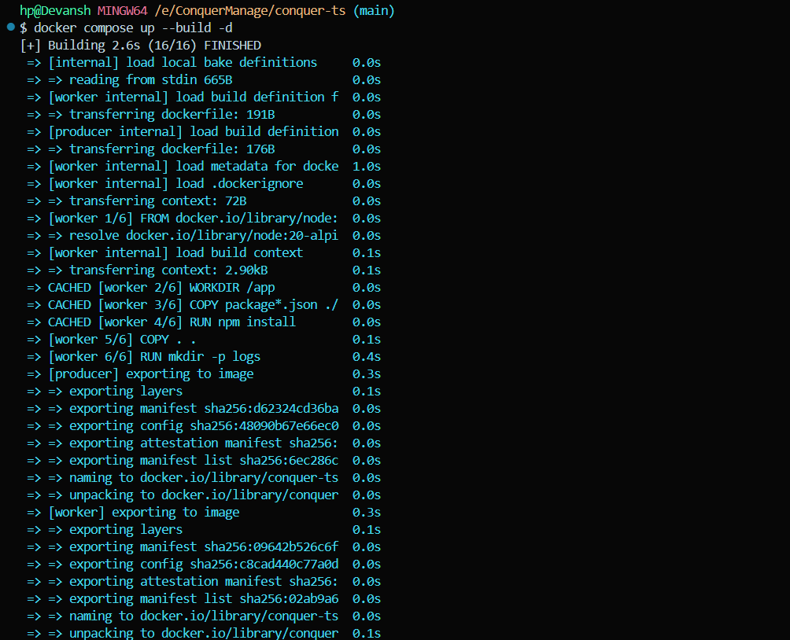
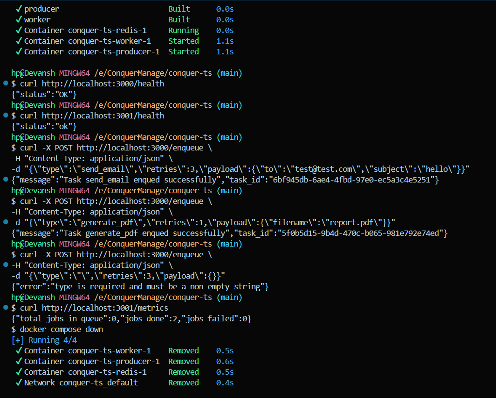

# ConquerManage

A distributed background task processing system built with TypeScript and Redis.

## What does it do?

Let's say a user signs up on your website and you want to send them a welcome email. If you send the email inside the API call, the user waits until the email is actually sent. That's slow.

Instead, you push a `send_email` task to a Redis queue, respond to the user instantly, and a background worker picks it up and sends the email separately.

That's what this system does. It has two services:

- **Producer** — an Express server with a `POST /enqueue` endpoint. You send it a task, it validates it, assigns a unique ID, and pushes it to Redis.
- **Worker** — pulls tasks from Redis, processes them, handles retries if something fails, and logs everything to a file.

It's not limited to emails — you can add any task type (image resizing, PDF generation, etc.) by just adding a case in the processor switch statement.

## How it works

```
Client (POST /enqueue) → Producer → Redis (task_queue) → Worker → Execute Task
                                                            ↓
                                                     On failure:
                                                     retries > 0 → re-enqueue
                                                     retries = 0 → dead letter queue
```

The worker runs multiple concurrent loops using `Promise.all` (configured via `WORKER_CONCURRENCY`). Each loop does a `BLPOP` on the Redis list which blocks until a task is available — so no polling or busy waiting.

## Demo





## Tech used

- TypeScript + Node.js
- Express.js for HTTP
- ioredis for Redis
- dotenv for env config
- fs module for logging

## Running

### Option 1: Docker (recommended)

Just need Docker installed. No Node.js, no Redis setup, nothing else.

```bash
cd conquer-ts
docker compose up --build
```

This starts Redis, Producer (port 3000), and Worker (port 3001) automatically.

To stop everything:

```bash
docker compose down
```

### Option 2: Manual

You need Node.js and a running Redis instance. I used Docker for Redis:

```bash
docker run -d --name redis-stack -p 6379:6379 -p 8001:8001 redis/redis-stack:latest
```

Port 8001 gives you RedisInsight in the browser which is helpful for seeing what's in the queue.

```bash
cd conquer-ts
npm install
```

Copy `.env.example` to `.env` and fill in your values:

```
REDIS_URL=redis://localhost:6379/1
PORT_PRODUCER=3000
PORT_WORKER=3001
WORKER_CONCURRENCY=3
```

Open two terminals:

```bash
# Terminal 1 - start the producer
npm run producer

# Terminal 2 - start the worker
npm run worker
```

## Testing it out

Send a task:

```bash
curl -X POST http://localhost:3000/enqueue \
  -H "Content-Type: application/json" \
  -d '{"type":"send_email","retries":3,"payload":{"to":"test@test.com","subject":"hello"}}'
```

You should see the worker pick it up and log it. Check the metrics:

```bash
curl http://localhost:3001/metrics
```

Health checks:

```bash
curl http://localhost:3000/health
curl http://localhost:3001/health
```

Try sending an invalid task to see validation:

```bash
curl -X POST http://localhost:3000/enqueue \
  -H "Content-Type: application/json" \
  -d '{"type":"","retries":3,"payload":{}}'
```

## Supported task types

- `send_email` — needs `to` and `subject` in payload
- `resize_image` — needs `new_x` and `new_y` in payload
- `generate_pdf` — just logs that it's generating

To add a new type, add a case in `src/internal/processor.ts`. That's it.

## Project structure

```
conquer-ts/
├── src/
│   ├── config/
│   │   └── redis.ts           # Redis connection
│   ├── internal/
│   │   ├── task.ts            # Task and Metrics interfaces
│   │   ├── processor.ts       # switch-case task execution
│   │   └── logger.ts          # logs to file
│   ├── producer/
│   │   └── index.ts           # POST /enqueue, GET /health
│   └── worker/
│       └── index.ts           # task processing loop, GET /metrics, GET /health
├── logs/
│   └── worker.log
├── Dockerfile.producer
├── Dockerfile.worker
├── docker-compose.yml
├── .dockerignore
├── .env.example
├── package.json
└── tsconfig.json
```

## Features

1. **Dead Letter Queue** — failed tasks (after all retries) go to `task_queue:dead` instead of disappearing
2. **Graceful Shutdown** — worker stops cleanly on Ctrl+C, finishes current tasks before exiting
3. **Health checks** — both services have `/health` that pings Redis
4. **Input validation** — producer validates each field with clear error messages
5. **Task IDs** — every task gets a UUID, makes it easy to trace in logs
6. **Configurable concurrency** — set `WORKER_CONCURRENCY` in .env instead of hardcoding

## Logs

The worker writes to `logs/worker.log`. Looks like this:

```
SUCCESS | Time: 2026-03-18T20:58:46.588Z | Task ID: 254f3cea-... | Type: send_email | Payload: {"to":"test@test.com","subject":"hello"} | retries left: 3
FAILURE | Time: 2026-03-18T21:03:14.664Z | Task ID: 8dbcfafd-... | ERROR: UnSupported Task:unknown_task | Type: unknown_task | Payload: {"data":"test"} | retries left: 2
```
